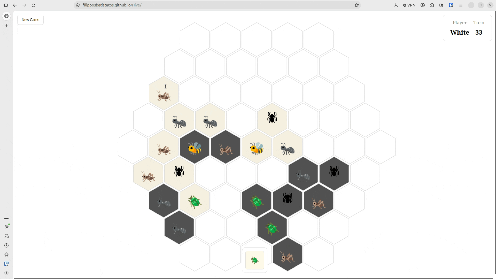

# Hive

Hexagonal, infinite-grid chess with bugs.

Chess engines are a common learning project, usually built on minimax with optimisations such as alpha-beta pruning. Hive is a harder target for the same techniques. It has no board, so pieces can be placed anywhere around the growing hive, and its pieces are far more mobile than chess pieces: an Ant can reach dozens of destinations from a single position. That gives the game tree a much larger branching factor, so every optimisation in the engine has a bigger effect on how strong the bot can be.



## Play

You can play against the bot, or against a friend, [here](https://filipposbatistatos.github.io/Hive/).

## Build and run
Instruction on building can be found in the backend folder. 
A prebuilt version is available in the `docs` folder.

```bash
# Run the test suite
cargo test

# Serve the front end locally
cd docs && python3 -m http.serve 8000
```

## Project layout

| Folder     | Contents                                                        |
| ---------- | --------------------------------------------------------------- |
| `backend/` | The Rust engine: rules, move generation, tests                  |
| `app/`     | The web front end that talks to the engine through WebAssembly  |
| `docs/`    | Where the playable app is hosted                                |

The engine is built around four small types:

| Type       | Meaning                                                                                      |
| ---------- | -------------------------------------------------------------------------------------------- |
| `Position` | A hex cell in axial coordinates, `{ q, r }`                                                  |
| `Piece`    | A bug (`PieceKind`) and its owner (`Player`)                                                 |
| `Board`    | An immutable map from `Position` to a stack of pieces. `place_piece` and `remove_piece` return a new `Board` instead of mutating |
| `Move`     | Either `Place { kind, at }` from the player's hand, or `Move { from, to }` on the board      |

## Implementation

This Hive engine is written in Rust in a functional style. It is tested with a combination of expect tests and property tests.

### Language choice

Rust supports a functional paradigm, offers C-like performance, and compiles easily to WebAssembly, so the project can be hosted on a website.

### Programming style

Functional programming works well with Rust. Both aim to prevent the same class of bugs by limiting shared mutable state. I also find that removing the surrounding environment and limiting mutation lets me break problems into small pieces I can reason about.

A functional style also makes full use of property testing, which I found invaluable in parts of this project.

## The game

The creators explain the rules better than I can, [here](https://hivegame.com/download/rules.pdf). The basics:

- Don't let your queen get surrounded.
- Never break the hive.
- Surround the enemy queen to win.

### Game rules

Hexagons are represented with axial coordinates. An easy way to understand the system is to imagine a Cartesian plane whose x and y axes are 120 degrees apart instead of 90. The visualisation tool I used throughout this project was [this article](https://www.redblobgames.com/grids/hexagons/#:~:text=Axial%20coordinates).

#### Placement

To place a piece, the target cell must be empty and must neighbour only allied bugs. There is one exception: the first black piece has to join the hive, so it must touch a white piece.

``` rust
fn can_place(board: &Board, position: Position, player: Player) -> bool {
    if board.stacks.is_empty() {
        return true;
    }

    !is_occupied(position, board)
        && is_on_hive(board, position, None)
        && !adjacent_to_opponent(board, position, player)
}

pub fn legal_placements(board: &Board, player: Player) -> HashSet<Position> {
    if board.stacks.is_empty() {
        return HashSet::from([Position { q: 0, r: 0 }]); // First piece ideally placed in the origin
    }

    if board.stacks.len() == 1 {
        // This is the second move and therefore, has to be adjacent to a different color
        if let Some(&single_pos) = board.stacks.keys().next() {
            return HashSet::from_iter(neighbors(single_pos));
        }
    }

    board.stacks
        .keys()
        .flat_map(|pos| neighbors(*pos))
        .filter(|&candidate| can_place(board, candidate, player))
        .collect()
}
```

The two edge cases are handled first: the first piece goes at the centre of the coordinate system, and the second piece goes next to it. After that, we look at the cells adjacent to every piece on the board and keep the ones where a piece can legally be placed.

#### Never break the hive

All pieces must stay connected to the hive. A move is illegal if lifting the piece would split the hive in two (the piece is an *articulation point*, or cut vertex), or if the piece would land somewhere detached from the hive.

``` rust
fn connected_positions(occupied: &HashSet<Position>, start: Position) -> HashSet<Position> {
    // Part of preserves hive executing the DFS to ensure that every piece is reachable
    fn visit(
        occupied: &HashSet<Position>,
        current: Position,
        mut visited: HashSet<Position>,
    ) -> HashSet<Position> {
        if visited.contains(&current) {
            return visited;
        }

        visited.insert(current);

        neighbors(current)
            .into_iter()
            .filter(|n| occupied.contains(n))
            .fold(visited, |acc, n| visit(occupied, n, acc))
    }

    visit(occupied, start, HashSet::new())
}

fn preserves_hive(board: &Board, from: Position) -> bool {
    // Does the hive maintain its integrity if this piece is removed from this position
    // Uses DFS to ensure that all the pieces are connected with each other 

    let remaining_pieces: HashSet<Position> = board.stacks
        .keys()
        .copied()
        .filter(|&pos| pos != from)
        .collect();
    
    match remaining_pieces.iter().next() {
        None => true,
        Some(&start) => connected_positions(&remaining_pieces, start).len() == remaining_pieces.len(),
    }
}
```

A depth-first search walks from piece to piece and checks that everything is still reachable. If removing the piece leaves some pieces unreachable, the move is illegal.

Each check costs O(n), where n is the number of occupied cells (stacks, not pieces, because Beetles can stack on top of each other). For player-versus-player mode that is fine, since the user moves one piece at a time. Minimax is different: the engine asks for the moves of every piece in every position, so move generation costs O(n²) per position.

There is a better way. All articulation points can be found in a single O(n) pass with Tarjan's algorithm, and those pieces can then be excluded from movement. That would require a second move-generation path used only by the engine, so I have held off for now.

A smaller optimisation is the `is_on_hive` function:

```rust
fn is_on_hive(board: &Board, to: Position, from: Option<Position>) -> bool {
    // Ensures that possible moves are still on the hive,
    // and therefore wont break the one hive rule 
    match from {
        None => {
            neighbors(to)
                .into_iter()
                .any(|n| is_occupied(n, board))
        } 
        Some(from) => {
            let from_neighbors: HashSet<Position> = neighbors(from).into_iter().collect();
            let to_neighbors: HashSet<Position> = neighbors(to).into_iter().collect();
            
            from_neighbors.contains(&to)
                && from_neighbors
                    .intersection(&to_neighbors)
                    .any(|&n| is_occupied(n, board))
        }
    }
}
```

With this check, a move only has to confirm that its destination touches the hive, instead of re-verifying the connectivity of the whole hive. There is one edge case: a moving piece is still on the board while its move is checked, so it must not count itself as support. The exception is a piece placed from the hand, which is not on the board yet.

#### Sliding

Most pieces slide along the hive, and a piece cannot slide through a gap it does not fit through.

```rust
fn flanking_positions(a: Position, b: Position) -> HashSet<Position> {
    let a_neighbors: HashSet<Position> = neighbors(a).into_iter().collect();
    let b_neighbors: HashSet<Position> = neighbors(b).into_iter().collect();

    a_neighbors.intersection(&b_neighbors).copied().collect()
}

fn can_slide(board: &Board, from: Position, to: Position, piece_height: usize) -> bool {
    // Apply the freedom to move rule: a gap is passable if at least one of the 
    // flanking positions are shorter or empty than the height of the piece passing through
    
    flanking_positions(from, to)
        .iter()
        .any(|&p| stack_height(board, &p) < piece_height)
}
```

The key insight is that a slide is blocked by its two flanking positions, the cells adjacent to both the start and the destination. If both are as tall as the moving piece, it cannot squeeze through.

> You may notice that `is_occupied` is not used to check the flanks. That is because of the Beetle, which has to obey the sliding rules even while it is on top of other pieces. An occupancy check would leave a climbing Beetle stuck. What matters is whether the flanks are at least as tall as the piece that is moving.

### Pieces

This section covers how each piece moves. Every piece is built on the Bee's single-step slide, so a piece like the Ant moves recursively in Bee-like steps. That lets the basic rules above be applied one step at a time.

#### Queen Bee

The Queen Bee is the simplest piece. It slides one cell in any direction, as long as the move respects the other rules.

```rust
fn bee_moves(pos: &Position, board: &Board) -> Vec<Move> {
    // Returns the legal moves for the bee piece
    if !preserves_hive(board, *pos) {
        return Vec::<Move>::new();
    }

    neighbors(*pos)
        .into_iter()
        .filter(|&candidate| !is_occupied(candidate, board))
        .filter(|&candidate| is_on_hive(board, candidate, Some(*pos)))
        .filter(|&candidate| can_slide(board, *pos, candidate, 1))
        .map(|candidate| Move::Move {from: *pos, to: candidate })
        .collect()
}
```

The same pattern is reused by most of the pieces. First we check that the piece is allowed to move without breaking the hive. Then we take its neighbours, drop the occupied ones, drop the ones that are off the hive, and drop the ones the piece is blocked from sliding into. The survivors are mapped into `Move` values.

#### Ant

The Ant has no limit on how far it can travel. It can keep sliding around the outside of the hive indefinitely.

```rust
fn ant_moves(pos: &Position, board: &Board) -> Vec<Move> {
    // Returns the legal ant moves
    if !preserves_hive(board, *pos) {
        return Vec::<Move>::new();
    }

    fn visit(board: &Board, pos: Position, mut visited: HashSet<Position>) -> HashSet<Position> {
        if visited.contains(&pos) {
            return visited;
        }

        visited.insert(pos);
        neighbors(pos)
            .into_iter()
            .filter(|&candidate| !is_occupied(candidate, board))
            .filter(|&candidate| is_on_hive(board, candidate, Some(pos))) 
            .filter(|&candidate| can_slide(board, pos, candidate, 1))
            .fold(visited, |acc, pos| visit(board, pos, acc))
    }

    visit(&board.remove_piece(*pos), *pos, HashSet::<Position>::new())
        .into_iter()
        .map(|candidate| Move::Move {from: *pos, to: candidate})
        .collect::<Vec<Move>>()
}
```

#### Spider

The Spider moves like the Ant, with one major difference: it must slide exactly three cells.

```rust
fn spider_moves(pos: &Position, board: &Board) -> Vec<Move> {
    // Returns a vector of the legals moves for spider
    if !preserves_hive(board, *pos) {
        return Vec::<Move>::new();
    }
    
    // The spider moves exactly 3 spots away from where it is in the same nature are the ant
    fn visit(board: &Board, pos: Position, visited: HashSet<Position>, steps_remaining: u8) -> HashSet<Position> {
        if steps_remaining == 0 {
            return HashSet::from([pos]); // Only the final landing spot 
        }
        
        neighbors(pos)
            .into_iter()
            .filter(|&n| !visited.contains(&n))
            .filter(|&n| !is_occupied(n, board))
            .filter(|&n| is_on_hive(board, n, Some(pos)))
            .filter(|&n| can_slide(board, pos, n, 1))
            .fold(HashSet::new(), |acc, n| {
                let mut next_visited = visited.clone();
                next_visited.insert(n);
                acc.union(&visit(board, n, next_visited, steps_remaining - 1)).copied().collect()
            })
    }
    
    visit(&board.remove_piece(*pos), *pos, HashSet::from([*pos]), 3)
        .into_iter()
        .map(|candidate| Move::Move{ from: *pos, to: candidate })
        .collect()
}
```

#### Grasshopper

The Grasshopper jumps instead of sliding, so it can reach places other pieces cannot. It moves in straight lines, jumping over the adjacent pieces in its path.

```rust
fn grasshopper_moves(pos: &Position, board: &Board) -> Vec<Move> {
    // Grasshopper moves in straight lines jumping over pieces
    if !preserves_hive(board, *pos) {
        return vec![];
    }

    fn jump(board: &Board, pos: Position, direction: (i32, i32)) -> Position {
        let next = Position { q: pos.q + direction.0, r: pos.r + direction.1 };
        if is_occupied(next, board) {
            return jump(board, next, direction);
        }
        return next;
    }

    neighbors(*pos)
        .into_iter()
        .filter(|p| is_occupied(*p, board))
        .map(|p| jump(board, *pos, (p.q - pos.q, p.r - pos.r)))
        .map(|p| Move::Move { from: *pos, to: p})
        .collect()
}
```

#### Beetle

The Beetle slides like the Bee, but it can also climb on top of other pieces. It caused the biggest refactor of the project: it follows the same sliding rules as everything else, so its climbing behaviour had to be reworked to respect them.

```rust
fn beetle_moves(pos: &Position, board: &Board) -> Vec<Move> {
    // Hive preservation only applies on ground level
    if stack_height(board, pos) == 1 && !preserves_hive(board, *pos) {
        return vec![];
    }

    neighbors(*pos)
        .into_iter()
        .filter(|p| is_on_hive(board, *p, Some(*pos)) || is_occupied(*p, board))
        .filter(|p| can_slide(board, *p, *pos, stack_height(board, pos)) || stack_height(board, p) >= stack_height(board, pos)) 
        .map(|p| Move::Move { from: *pos, to: p})
        .collect()
}
```

## Engine

## Testing

One of my motivations for this project was to use property testing on a more complicated problem. However good an engineer is, computers are unforgiving and edge cases are easy to miss. The suite uses three kinds of test, each doing a different job.

### Expect tests

Expect tests use the [`expect-test`](https://crates.io/crates/expect-test) crate. The expected output lives inside the test itself, as a string literal in the source file. When behaviour changes, you run the tests with `UPDATE_EXPECT=1 cargo test` and the literals are rewritten in place. You then review the change in `git diff`, the same way you review any other code change.

I like this style for two reasons. It makes a test a readable description of what the function should do, and when something breaks, the failure shows exactly what the output looked like and how it differed.

Because positions on a hex grid are hard to read as coordinates, the tests render boards and moves as small hex diagrams. Each row is shifted half a cell further right than the one above, so adjacency reads visually. In a snapshot, `A` is a piece. In a move render, `A` marks a legal destination and `.` marks a cell that is not.

Here is a Bee surrounded by five other pieces. The expected output shows the two cells it can slide into:

> Improvements: I would like to make the tests render the entire board and mark the moves with an `X` instead. Besides been more readable, it would allow for more complecated tests. 

```rust
#[test]
fn correct_bee_moves() {
    let occupied_positions = vec![
        Position {q: 1, r: 0},
        Position {q: 1, r: 1},
        Position {q: 0, r: 2},
        Position {q: -1, r: 2},
        Position {q: -1, r: 1},
    ];
    
    let board = occupied_positions.iter().fold(Board::new(), |board, &pos| {
        board.place_piece(pos, Piece {kind: PieceKind::Ant, owner: Player::White })
    });
    let moves = bee_moves(&Position {q: 0, r: 0}, &board);
    let output = render_moves(&moves);

    expect![[r#"
        . . A
         A . ."#]].assert_eq(&output);
}
```

The same approach covers every piece, including stacked Beetles (`complex_beetle_moves`), the placement rules, and the empty-board and single-piece edge cases.

### Example-based tests

Some rules are small enough to state directly. These tests use plain assertions:

```rust
#[test]
fn removing_a_bridge_piece_breaks_the_hive() {
    let board = Board::new()
        .place_piece(Position { q: 0, r: 0}, Piece { kind: PieceKind::Ant, owner: Player::White })
        .place_piece(Position { q: 1, r: 0}, Piece { kind: PieceKind::Ant, owner: Player::White })
        .place_piece(Position { q: 2, r: 0}, Piece { kind: PieceKind::Ant, owner: Player::White });
    
    assert!(!preserves_hive(&board, Position {q: 1, r: 0}));
    assert!(preserves_hive(&board, Position {q: 2, r: 0}));
}
```

This test has little to represent visually, so a simple assertion is enough to ensure the test works

### Property tests

Example tests only cover the cases I thought of. Property tests use [`proptest`](https://crates.io/crates/proptest) to generate many random boards and check that a rule holds for all of them. If a property fails, proptest shrinks the failing board to a minimal case.

```rust
proptest! {
    #[test]
    fn legal_place_have_no_enemy_neighbors (board in arbitrary_board(8), player in arbitrary_player()) {
        // Iterate over different boards to ensure that the positions they produce
        // do not come in contact with any enemies
        let placements = legal_placements(&board, player);
        prop_assert!(
            placements.iter().all(|&p| !adjacent_to_opponent(&board, p, player))
        );
    }
}
```

`arbitrary_board` and `arbitrary_player` are strategies that describe how to generate random inputs. Because the board is an immutable value and the move generators are pure functions, a test only has to build a board and call the function. There is no setup or teardown, and no hidden state to worry about.

Property based testing was exceptionally usefull when creating the engine. Part of the engine is getting all the available moves, but a player can be fully blocked. In which case they have no other option but to pass. I run into a couple of problems where I didn't realise why the engine was crashing. The issue was that even though I was sure the move generator returned at least one move, it often did not, but by code was written with that hypothesis in mind. 
``` rust
pub fn best_move(state: &GameState, depth: u32) -> Move {
    all_legal_moves(state)
        .into_iter()
        [...]
        .expect("all_legal_moves never returns an empty list")
}
```

So I made a test to ensure that my assumption was correct.
```rust
proptest! {
    #[test]
    fn all_legal_moves_is_never_empty(
        board in arbitrary_board(8),
        player in arbitrary_player(),
        hand in arbitrary_hand(),
    ) {
        let state = GameState {
            board: board,
            turn: player,
            turn_number: 1,
            unplaced: HashMap::from([
                (player, hand),
                (opponent(player), HashMap::new()),
            ]),
            result: None
        };

        prop_assert!(all_legal_moves(&state).len() > 0);
    }
}

proptest! {
    #[test]
    fn all_legal_moves_only_contains_pass_if_otherwise_empty(
        board in arbitrary_board(8),
        player in arbitrary_player(),
        hand in arbitrary_hand(),
    ) {
        let state = GameState {
            board: board,
            turn: player,
            turn_number: 1,
            unplaced: HashMap::from([
                (player, hand),
                (opponent(player), HashMap::new()),
            ]),
            result: None
        };

        let moves = all_legal_moves(&state);
        let length = moves.len();
        let contains_pass = moves
            .into_iter()
            .any(|mv| mv == Move::Pass);

        prop_assert!(!contains_pass || length == 1) 
    }
}
```

These two tests alone, have saved hours of debugging. 